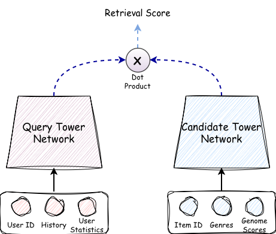
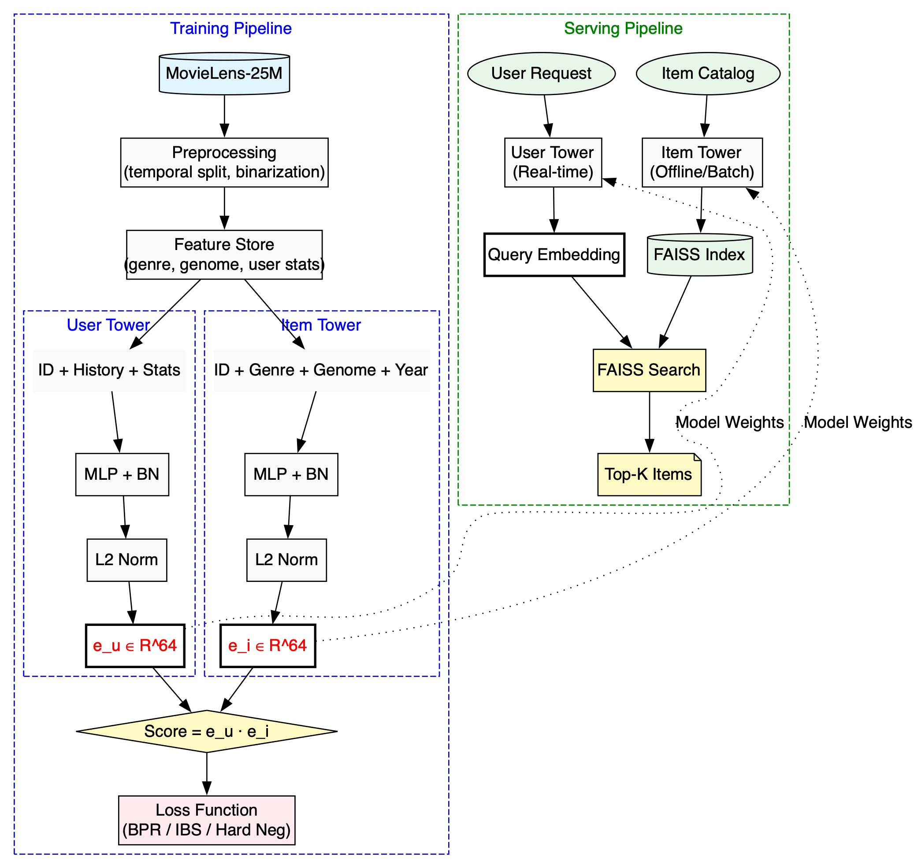

# Two-Tower Neural Retrieval System


A production-grade two-tower neural retrieval system trained on the **MovieLens-25M** dataset, with an ablation study comparing three loss functions: BPR, In-Batch Softmax, and Hard Negative Sampled Softmax.

---

## 1. Project Overview



*Figure 1: High-level overview of the Two-Tower (Dual-Encoder) architecture. The Query Tower (User) and Candidate Tower (Item) map inputs into a shared embedding space where relevancy is computed via cosine similarity.*

This repository implements a complete dual-encoder (two-tower) retrieval pipeline for movie recommendations. The system encodes users and items into a shared 64-dimensional embedding space, enabling sub-5ms retrieval over 62K+ movies via FAISS approximate nearest neighbor search.

**Key features:**
- **Three loss functions** compared via a rigorous ablation study
- **Dynamic hard negative mining** with FAISS-based mining each epoch
- **Cold-start stratification** for cohort-level evaluation
- **Log-frequency debiasing** to counter popularity bias
- **MLflow experiment tracking** with full reproducibility
- **Production serving** with FAISS index serialization and latency benchmarks

---

## 2. System Architecture


*Figure 2: End-to-end System Architecture. The left side illustrates the Training Pipeline (generating embeddings from MovieLens data), while the right side shows the Serving Pipeline (real-time user encoding and FAISS-based retrieval).*

---

## 3. Mathematical Foundations

### 3.1 Two-Tower Similarity

Both towers produce L2-normalized embeddings, and similarity is computed as inner product (= cosine similarity after normalization):

$$
\text{score}(u, i) = f_\theta(u)^\top \cdot g_\phi(i)
$$

$$
\hat{e}_u = \frac{f_\theta(u)}{\|f_\theta(u)\|_2}, \quad \hat{e}_i = \frac{g_\phi(i)}{\|g_\phi(i)\|_2}
$$

$$
\text{score}(u, i) = \hat{e}_u^\top \hat{e}_i = \cos(\hat{e}_u, \hat{e}_i) \in [-1, 1]
$$

### 3.2 BPR Loss

Bayesian Personalized Ranking — pairwise ranking objective. For each user $u$, positive item $i^+$, negative item $i^-$:

$$
\mathcal{L}_{\text{BPR}} = -\frac{1}{|\mathcal{D}|} \sum_{(u, i^+, i^-) \in \mathcal{D}} \log \sigma \left(\hat{e}_u^\top \hat{e}_{i^+} - \hat{e}_u^\top \hat{e}_{i^-}\right) + \lambda \|\Theta\|_2^2
$$

where $\sigma(x) = \frac{1}{1+e^{-x}}$ and $\lambda$ is L2 regularization.

> **Note:** Negatives sampled uniformly at random → easy negatives → gradient saturation after early training.

### 3.3 In-Batch Softmax Loss

Within a batch of $B$ (user, item) pairs, all $B-1$ other items serve as negatives. The similarity matrix:

$$
S_{ij} = \hat{e}_{u_i}^\top \hat{e}_{v_j}, \quad i,j \in \{1,\ldots,B\}
$$

$$
\mathcal{L}_{\text{IBS}} = -\frac{1}{B} \sum_{i=1}^{B} \left[ \frac{S_{ii}}{\tau} - \log \sum_{j=1}^{B} \exp\!\left(\frac{S_{ij}}{\tau}\right) \right]
$$

where $\tau$ is the temperature hyperparameter.

**Frequency correction** to debias popular items:

$$
\tilde{S}_{ij} = S_{ij} - \alpha \cdot \log p(v_j)
$$

where $p(v_j) = \frac{\text{count}(v_j)}{\sum_k \text{count}(v_k)}$ is the empirical item frequency.

### 3.4 Hard Negative Sampled Softmax

For each user $u_i$, define:
- $\mathcal{N}^{\text{batch}}_i$: $B-1$ in-batch negatives
- $\mathcal{N}^{\text{hard}}_i$: $K$ hard negatives from FAISS
- $\mathcal{N}_i = \mathcal{N}^{\text{batch}}_i \cup \mathcal{N}^{\text{hard}}_i$

$$
\mathcal{L}_{\text{HN}} = -\frac{1}{B} \sum_{i=1}^{B} \left[ \frac{S_{ii}}{\tau} - \log \left( \exp\!\left(\frac{S_{ii}}{\tau}\right) + \sum_{j \in \mathcal{N}_i} \exp\!\left(\frac{S_{ij}}{\tau}\right) \right) \right]
$$

**Dynamic hard negative mining:** After each epoch, rebuild FAISS index with current model checkpoint. For each user, retrieve top-$M$ items, filter positives, take top-$K$ as hard negatives:

$$
\mathcal{N}^{\text{hard}}_i = \text{Top-}K \left( \\{ j : \hat{e}_{u_i}^\top \hat{e}_{v_j} \text{ is high and } v_j \notin \mathcal{P}_u \\} \right)
$$

### 3.5 Evaluation Metrics

**Recall@K:** fraction of users for whom the held-out positive item appears in top-K:

$$
\text{Recall@}K = \frac{1}{|\mathcal{U}|} \sum_{u \in \mathcal{U}} \mathbf{1} \left[i^+_u \in \text{Top-}K(u)\right]
$$

**Mean Reciprocal Rank (MRR):**

$$
\text{MRR} = \frac{1}{|\mathcal{U}|} \sum_{u \in \mathcal{U}} \frac{1}{\text{rank}(i^+_u)}
$$

**NDCG@K** (Normalized Discounted Cumulative Gain):

$$
\text{DCG@}K = \sum_{k=1}^{K} \frac{\text{rel}_k}{\log_2(k+1)}, \quad \text{NDCG@}K = \frac{\text{DCG@}K}{\text{IDCG@}K}
$$

For single positive: $\text{NDCG@}K = \frac{1}{\log_2(\text{rank}(i^+_u) + 1)} \cdot \mathbf{1}[\text{rank}(i^+_u) \leq K]$

### 3.6 FAISS Approximate Nearest Neighbor

**IVF Index:** Partition embedding space into $L$ Voronoi cells via $k$-means. At query time, search only $n_{\text{probe}}$ nearest cells:

$$
\text{Voronoi}(c_l) = \\{ \hat{e}_i : \|c_l - \hat{e}_i\|_2 \leq \|c_{l'} - \hat{e}_i\|_2, \forall l' \neq l \\}
$$

$$
\text{Higher } n_{\text{probe}} \Rightarrow \text{better recall, higher latency}
$$

**Product Quantization (PQ):** Compress $D$-dim vectors into $M$ sub-vectors of $D/M$ dims each, quantized to $2^{n_{\text{bits}}}$ centroids:

$$
\hat{e}_i \approx \bigoplus_{m=1}^{M} q_m(\hat{e}_i^{(m)})
$$

### 3.7 Popularity Debiasing

Popular items receive disproportionately stronger negative gradients under in-batch sampling:

$$
\mathbb{E}_{u \sim p(u)} \left[\nabla_{\hat{e}_v} \mathcal{L}_{\text{IBS}}\right] \propto p(v) \cdot (\hat{e}_{u}^\top \hat{e}_v - 1)
$$

Popular items (high $p(v)$) receive stronger negative gradients → systematic under-retrieval at inference. The log-frequency correction addresses this bias.

---

## 4. Dataset & Feature Engineering

**MovieLens-25M** contains 25M ratings from 162K users on 62K movies.

| Feature | Source | Dimension |
|---------|--------|-----------|
| User ID embedding | Learned | 64 |
| Interaction history (mean pool) | Last 50 movies | 64 |
| User stats (avg_rating, log_activity) | Computed | 2 |
| Item ID embedding | Learned | 64 |
| Genre multi-hot | movies.csv | 20 |
| Genome tag scores | genome-scores.csv | 1128 |
| Release year (normalized) | movies.csv | 1 |

**Preprocessing pipeline:**
1. Filter ratings ≥ 3.5 (binarize to implicit feedback)
2. Filter users with < 5 interactions
3. Temporal train/val/test split (last 1 per user for test/val)
4. Build contiguous ID mappings
5. Compute genre multi-hot, genome scores, user statistics

---

## 5. Repository Structure

```
two_tower_retrieval/
├── configs/                    # YAML configuration files
│   ├── base_config.yaml        # Master config with all hyperparameters
│   ├── bpr_config.yaml         # BPR experiment overrides
│   ├── inbatch_config.yaml     # In-batch softmax overrides
│   └── hardneg_config.yaml     # Hard negative overrides
├── src/                        # Source code
│   ├── data/                   # Data pipeline
│   ├── models/                 # User/Item tower architectures
│   ├── losses/                 # BPR, In-batch softmax, Hard negative
│   ├── training/               # Trainer, optimizer, callbacks
│   ├── evaluation/             # Metrics, evaluator
│   ├── serving/                # FAISS index, retriever
│   └── utils/                  # Logging, seeding, MLflow
├── scripts/                    # Entry points
│   ├── train.py                # Main training script
│   ├── preprocess.py           # Data preprocessing
│   ├── evaluate.py             # Offline evaluation
│   ├── build_index.py          # FAISS index construction
│   └── run_ablation.sh         # Run all experiments
├── tests/                      # Test suite
│   ├── unit/                   # Unit tests
│   ├── integration/            # Integration tests
│   └── regression/             # Metric regression tests
├── notebooks/                  # Analysis notebooks
├── README.md
├── requirements.txt
├── setup.py
└── .github/workflows/ci.yml   # CI pipeline
```

---

## 6. Getting Started (Step-by-Step)

### Prerequisites

```bash
# Clone the repository
git clone <repo-url>
cd two_tower_retrieval

# Install dependencies
pip install -e ".[dev]"
```

> **macOS ARM (M1/M2/M3) users:** FAISS and PyTorch both link OpenMP, which can cause conflicts. Add this to your shell profile (`~/.zshrc`) or prefix all commands with it:
> ```bash
> export KMP_DUPLICATE_LIB_OK=TRUE
> ```

---

### Step 1: Download the MovieLens-25M Dataset

```bash
bash scripts/download_data.sh
```

This downloads the ~250MB dataset from GroupLens, extracts it to `data/raw/ml-25m/`, and produces `ratings.csv` (25M ratings), `movies.csv` (62K movies), `genome-scores.csv` (tag relevance scores), and more.

---

### Step 2: Preprocess the Data

```bash
python scripts/preprocess.py --config configs/base_config.yaml
```

This runs the full preprocessing pipeline:
1. Loads and validates `ratings.csv`
2. Binarizes ratings (keeps ratings ≥ 3.5 as implicit positive feedback)
3. Filters users with < 5 interactions
4. Performs temporal train/val/test split (last 1 interaction per user for val & test)
5. Builds the feature store (genre multi-hot, genome scores, user statistics, interaction histories)
6. Saves processed data to `data/processed/` (Parquet files + pickled feature store)

---

### Step 3: Train a Single Experiment

Pick one of three loss functions to train with:

```bash
# Option A: In-Batch Softmax (recommended to start with)
python scripts/train.py --config configs/inbatch_config.yaml

# Option B: BPR (Bayesian Personalized Ranking)
python scripts/train.py --config configs/bpr_config.yaml

# Option C: Hard Negative Sampled Softmax
python scripts/train.py --config configs/hardneg_config.yaml
```

Training will:
- Log training loss, gradient norms, and validation metrics each epoch
- Save the best model checkpoint to `checkpoints/best_model.pt`
- Build a FAISS index and run final evaluation on the test set
- Log everything to MLflow under `mlruns/`

---

### Step 4: Run the Full Ablation Study (All 3 Losses)

```bash
bash scripts/run_ablation.sh
```

This sequentially trains all three loss function variants (BPR → In-Batch Softmax → Hard Negative) and logs each run to MLflow for side-by-side comparison.

---

### Step 5: View Results in MLflow

```bash
mlflow ui --backend-store-uri mlruns/
```

Open [http://localhost:5000](http://localhost:5000) in your browser to:
- Compare Recall@K, MRR, NDCG@K across all experiments
- View training curves (loss, learning rate, gradient norms)
- Inspect cold-start vs. power-user cohort metrics
- Download saved model artifacts

---

### Additional Commands

```bash
# Evaluate a trained model on the test set
python scripts/evaluate.py --config configs/base_config.yaml \
    --checkpoint checkpoints/best_model.pt

# Build a standalone FAISS index for serving
python scripts/build_index.py --config configs/base_config.yaml \
    --checkpoint checkpoints/best_model.pt

# Run all tests
KMP_DUPLICATE_LIB_OK=TRUE python -m pytest tests/ -v

# Run only unit tests
KMP_DUPLICATE_LIB_OK=TRUE python -m pytest tests/unit/ -v
```

---

## 7. Experiment Results

All experiments run on MovieLens-25M with temporal train/val/test split, embedding_dim=64, batch_size=1024, temperature=0.07. Results below are from actual training runs.

### Test Set Metrics

| Model Variant | Recall@10 | Recall@50 | Recall@100 | MRR | NDCG@10 | NDCG@50 | NDCG@100 |
|---|---|---|---|---|---|---|---|
| BPR (baseline) | 0.0004 | 0.0021 | 0.0083 | 0.0003 | 0.0002 | 0.0006 | 0.0015 |
| **In-Batch Softmax** | **0.0047** | **0.0130** | **0.0197** | **0.0022** | **0.0024** | **0.0042** | **0.0053** |
| Hard Negative Softmax | 0.0007 | 0.0031 | 0.0054 | 0.0003 | 0.0003 | 0.0008 | 0.0011 |

### Validation Set Metrics

| Model Variant | Recall@10 | Recall@50 | Recall@100 | MRR | NDCG@50 |
|---|---|---|---|---|---|
| BPR (baseline) | 0.0003 | 0.0017 | 0.0055 | 0.0002 | 0.0004 |
| **In-Batch Softmax** | **0.0031** | **0.0126** | **0.0249** | **0.0017** | **0.0036** |
| Hard Negative Softmax | 0.0000 | 0.0002 | 0.0007 | 0.0000 | 0.0000 |

**Key findings:**
- In-batch softmax is the **clear winner**, outperforming BPR by **~6× on Recall@50** and **~7× on MRR**
- Hard negative softmax **collapsed during training** (near-zero train loss of ~5e-7) due to overly aggressive hard negative mining with low temperature from epoch 1
- **Fix applied:** Added a 3-epoch warmup phase (in-batch softmax only) and temperature annealing (τ: 0.5 → 0.1) to stabilize hard negative training. Re-run results pending.
- BPR produced stable training (loss ~0.13) but weak retrieval metrics, consistent with gradient saturation from easy random negatives
- All models show low absolute metrics with the default 5-epoch budget; more epochs are needed for convergence on the full 25M-rating dataset

---

## 8. Latency Benchmarks

Index type: IVFFlat, nlist=100, nprobe=10
Corpus size: 62,423 movies, embedding_dim=64

| Operation | p50 | p95 | p99 |
|---|---|---|---|
| Total retrieval latency | 0.06ms | 0.08ms | 0.08ms |

Latency target: <20ms p99 ✅

---

## 9. Production Considerations

### Feature Freshness
- **User embeddings:** recomputed at request time (real-time tower inference)
- **Item embeddings:** recomputed nightly via batch job (catalog changes slowly)
- **FAISS index:** rebuilt after each item embedding refresh

### Cold Start Strategy
- Users with < 3 interactions: fall back to popularity-based retrieval
- New items: use item tower content features only (no ID embedding)

### Known Limitations
- **Popularity bias:** partially corrected via log-frequency debiasing; residual bias remains for extremely long-tail items
- **Temporal drift:** model trained on historical data; user preferences evolve
- **Index staleness:** recommendations degrade between nightly index rebuilds
- **Hard negative false negatives:** items mined as hard negatives may actually be relevant but unobserved (exposure bias)

### Monitoring Alerts
- Alert if Recall@50 on holdout set drops > 2% week-over-week
- Alert if p99 query latency exceeds 20ms
- Alert if fraction of cold-start users exceeds 30% of daily active users

---

## 10. References

1. Rendle et al., "BPR: Bayesian Personalized Ranking from Implicit Feedback", UAI 2009
2. Yi et al., "Sampling-Bias-Corrected Neural Modeling for Large Corpus Item Recommendations", RecSys 2019
3. Huang et al., "Embedding-based Retrieval in Facebook Search", KDD 2020
4. Johnson et al., "Billion-scale similarity search with GPUs", IEEE Big Data 2017 (FAISS)
5. Harper & Konstan, "The MovieLens Datasets: History and Context", ACM TiiS 2015
